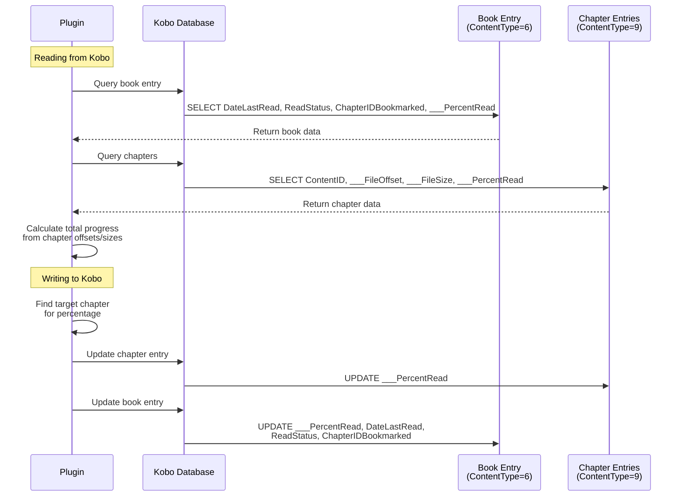

# Database Queries

This document lists all SQL queries used by the plugin to interact with the Kobo database.

## Virtual Library Book Discovery

The virtual library uses a reverse lookup approach to discover books:

```sql
-- Load all book metadata once at startup
SELECT ContentID, Title, Attribution, Publisher, Series, SeriesNumber, ___PercentRead
FROM content
WHERE ContentType = 6
  AND ContentID NOT LIKE 'file://%'
```

### Why Reverse Lookup?

Previously, the plugin queried the database first with ID format filters (`NOT LIKE '%-%'` to
exclude UUID-style IDs), then checked if those files existed. This failed for books synced from
Calibre Web which use UUID-style IDs like `a3a06c7b-f1a0-4f6b-8fae-33b6926124e4`.

The current approach:

1. **Loads all metadata once** from the database and caches it in memory
   - Fetches all books with ContentType=6 (books)
   - Excludes file:// prefixed paths which are not actual kepub files
   - Results are cached and reused until the database is modified
2. **Scans the kepub directory** (`/mnt/onboard/.kobo/kepub/`) for all files
3. **Filters out encrypted files** by checking for valid ZIP/EPUB signature (PK\x03\x04)
4. **Looks up metadata in cache** for unencrypted files (no additional database queries)
5. **Merges the results** to create the final accessible book list

This approach:

- Supports **all book ID formats** regardless of naming conventions
- Single database query for all metadata
- In-memory cache reused across multiple lookups

## Reading Progress (Pull from Kobo)

```sql
-- Main book query
SELECT DateLastRead, ReadStatus, ChapterIDBookmarked, ___PercentRead
FROM content
WHERE ContentID = ? AND ContentType = 6
LIMIT 1

-- Chapter lookup (to calculate exact progress using ___FileOffset directly)
SELECT ContentID, ___FileOffset, ___FileSize, ___PercentRead
FROM content
WHERE ContentID LIKE '?%' AND ContentType = 9
  AND (ContentID LIKE '%?' OR ContentID LIKE '%?#%')
LIMIT 1
```

## Writing Progress (Push to Kobo)

```sql
-- Find target chapter using ___FileOffset
SELECT ContentID, ___FileOffset, ___FileSize
FROM content
WHERE ContentID LIKE '?%' AND ContentType = 9
  AND ___FileOffset <= ?
ORDER BY ___FileOffset DESC
LIMIT 1

-- Fallback: Get last chapter (if position is beyond all chapters)
SELECT ContentID
FROM content
WHERE ContentID LIKE '?%' AND ContentType = 9
ORDER BY ___FileOffset DESC
LIMIT 1

-- Update main book entry
UPDATE content
SET ___PercentRead = ?,
    DateLastRead = ?,
    ReadStatus = ?,
    ChapterIDBookmarked = ?
WHERE ContentID = ? AND ContentType = 6

-- Update current chapter entry
UPDATE content
SET ___PercentRead = ?
WHERE ContentID = ? AND ContentType = 9
```

## Data Flow Diagram


